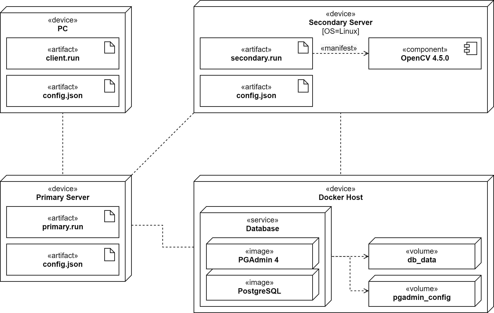

# pluggabl
**Pluggabl** started as my thesis project (final engineering project). It's an app for creating distributed computing service, that is easily extensible. Default connection between client and manager service is done by **unary gRPC**. Transfer of files and the job itself is done by **bidirectional streaming gRPC** - client sends task description and files and servers returns stream with outcome of the job performed on the worker. Communication between manager node and workers is done with **unary gRPC** and the files itself are transfered by the database (PostgreSQL holding *bytea* objects), as the nodes are supposed to be located inside single network (e.g. in Datacentre).

# Deployment scheme



# Additional tools:

## protobuf-compiler

Installation:
- Debian / Ubuntu
```
$ sudo apt-get update
$ sudo apt-get install protobuf-compiler
```
- Fedora 
```
$ dnf install protobuf-compiler
```
- CentOS / RedHat
```
$ dnf --enablerepo=PowerTools install protobuf-compiler
```

# Notes:

- SFIT is color dependent, and made to work mainly with grayscale images.
